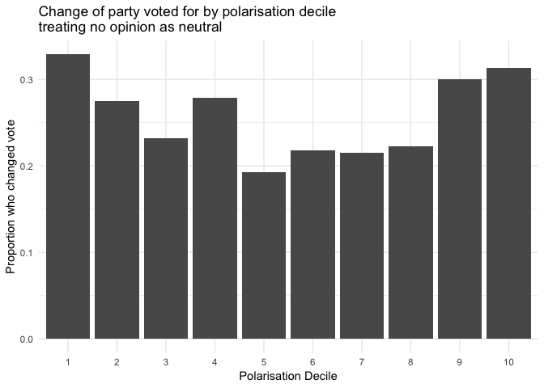
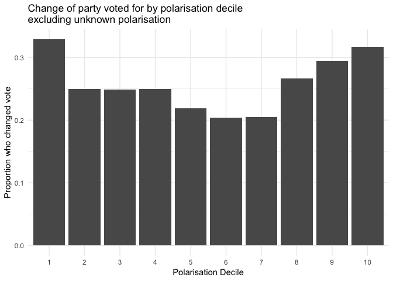

## Question

In the New Zealand MMP environment, is increasing polarisation of individuals associated with a decreased likelihood of swapping one's vote to a different party?

## Data 

This is using the 2014 New Zealand Election Study data set, publicly available from http://www.nzes.org/exec/show/data

The data is in SPSS format, but this example analyses it in R, using helper libraries to read the data in.

## Software

The exact version of R was 3.5.2. Helper libraries used were:

* foreign 0.8-71
* dplyr 0.7.8
* tidyr 0.8.2
* knitr 1.21
* ggplot2 3.1.0


```r
library(foreign)
library(dplyr)
library(tidyr)
library(knitr)
library(ggplot2)
```

## Reading in the data

For the data file, I am using read.spss() from the "foreign" package, wrapped up in a suppressWarnings() function. This is because some of the entries in the SPSS file are labelled, and it will generate a warning message for each variable that does not have a full set of labels. Using suppressWarnings() stops many, many, many, many lines informing your of this, while the variables read in fine and are stored as factors with a mix of textual labels (either based on label of the entry in SPSS or the textual form of the numeric value in the case of unlabeled entries).

As well as data file, from the data I am creating a meta file, containing the variable names and descriptions of the data. This is to make it easier to check the subject of each column in the data. This is done outside of this write up, but looking through the metadata version of the file is how I identified variables of interest.


```r
sav14 <- suppressWarnings(read.spss("NZES2014GeneralReleaseApril16.sav",
                    to.data.frame = TRUE, add.undeclared.levels = "sort"))
meta14 <- data.frame(varnames = attributes(sav14)$names,
                     descriptions = attributes(sav14)$variable.labels,
                     stringsAsFactors = FALSE)
```


## Voting change and polarisation

For changing votes, the data contains the variables dpartyvote (party voted for at the 2014 election) and dlastpvote (2014 statement of which party the respondent voted for in 2011).

From direct linkage with the 2011 NZES, we know from comparing those respondents sampled in both 2011 and 2014 that voters slightly overstate their party loyalty when remembering who they previously voted for. This is not expected to affect outcomes to this question, as we are interested more in variation in rates of change rather than absolute thresholds.

For this question a change in voting behavior is when the party a respondent voted for in 2011 does not match the party voted for in 2014. As such, I am choosing to exclude those who report not voting in 2011 or 2014, to avoid confusion around those too young to vote in 2011 and thus not able to exercise a voting choice.

For polarisation, the study asked each respondent how much they liked each of 10 political parties on an 11 point scale. I am treating polarisation as the amount of variation in each respondents liking of the parties, expressed by the standard deviation of the collective likings of each respondent.

Then I group the degree of polarisation into deciles, creating a 10 point scale of polarisation where the low end expresses the least difference between parties and those at the high end expressing the most difference between parties.

One "researcher degree of freedom" is how to treat those who did not know or refused to say how much they liked particular parties. These unknown responses can either be treated as a neutral response or excluded as unknown. To me, treating the unknown responses as neutral makes more sense, however to represent the data fairly I am going to repeat the analysis with the other option.

In the case of excluding entries, I will exercise another step of researcher degrees of freedom to exclude respondents that specified a liking of less than 4 of the 10 possible parties. It just seems pointless to determine the sd when they are not providing various much detail of the nuances with which they rate different parties. The degree to which 4 is the optimum number to set a threshold on is an open question, however the voters of the 4 largest parties account for 89.8% of responses, so expecting people to express a liking for at least 4 seems reasonable to me.

## Treating unknown response as neutral


```r
#take the 2014 nzes
as_neutral_decile <- sav14 %>% 
  # for entries with specified part votes
  filter(!is.na(dlastpvote), !is.na(dpartyvote),
         dlastpvote != "I did not vote / was not eligible",
         dlastpvote != "Don't know",
         dpartyvote != "Don't know") %>%
  # did the voted for party change from 2011 to 2014
  mutate(changed = as.character(dlastpvote) != 
           as.character(dpartyvote)) %>%
  # select ID number, change, and party like columns
  select(djacknum, changed, dlablike:dconslike) %>% 
  gather(party, liking, dlablike:dconslike) %>% 
  #convert likes to a numeric range with unknowns as neutral
  mutate(nlike = 
           case_when(
             liking == "Strongly dislike" ~ 0,
             liking == "Neutral" ~ 5,
             liking == "Strongly like" ~ 10,
             liking == "Don't know" ~ 5,
             is.na(liking) ~ 5,
             TRUE ~ as.numeric(liking)
           )) %>% 
  # for each respondent, keeping the if hey changed vote info
  group_by(djacknum, changed) %>%
  # calculate the sd of the respondents liking of parties
  summarise(polarisation = sd(nlike)) %>%
  ungroup() %>%
  # create polarisation deciles
  mutate(polarisation_step = ntile(polarisation,10)) %>%
  # for each polarisation decile
  group_by(polarisation_step) %>% 
  # calculate the proportion who changed vote between elections
  summarise(prop_changed = round(sum(changed)/n(), 3),
            n=n(),
            min_polar = round(min(polarisation), 2),
            max_polar = round(max(polarisation), 2))
```

### Table of unknown as neutral, changed vote by polarisation decile


```r
knitr::kable(as_neutral_decile %>% 
               select(polarisation_step, prop_changed))
```


 polarisation_step   prop_changed
------------------  -------------
                 1          0.329
                 2          0.275
                 3          0.232
                 4          0.279
                 5          0.193
                 6          0.218
                 7          0.215
                 8          0.223
                 9          0.300
                10          0.313

### Graph of unknown as neutral, changed vote by polarisation decile


```r
ggplot(data=as_neutral_decile,
       aes(x=as.factor(polarisation_step), y=prop_changed)) +
  geom_col() + theme_minimal() +
  xlab("Polarisation Decile") + 
  ylab("Proportion who changed vote") +
  ggtitle("Change of party voted for by polarisation decile
treating no opinion as neutral")
```

<!-- -->

## Excluding unknown liking responses


```r
#take the 2014 nzes
no_unknown_decile <- sav14 %>% 
  # for entries with specified part votes
  filter(!is.na(dlastpvote), !is.na(dpartyvote),
         dlastpvote != "I did not vote / was not eligible",
         dlastpvote != "Don't know",
         dpartyvote != "Don't know") %>%
  # did the voted for party change from 2011 to 2014
  mutate(changed = as.character(dlastpvote) != 
           as.character(dpartyvote)) %>%
  # select ID number, change, and party like columns
  select(djacknum, changed, dlablike:dconslike) %>% 
  gather(party, liking, dlablike:dconslike) %>% 
  #convert likes to a numeric range with unknowns as neutral
  mutate(nlike = 
           case_when(
             liking == "Strongly dislike" ~ 0,
             liking == "Neutral" ~ 5,
             liking == "Strongly like" ~ 10,
             liking == "Don't know" ~ NA_real_,
             is.na(liking) ~ NA_real_,
             TRUE ~ as.numeric(liking)
           )) %>% 
  # exclude unknown likings
  filter(!is.na(nlike)) %>%
  # for each respondent, keeping the if hey changed vote info
  group_by(djacknum, changed) %>%
  # calculate the sd of the respondents liking of parties
  summarise(polarisation = sd(nlike), n_party = n()) %>%
  ungroup() %>%
  # exclude those of less than 4 responses
  filter(n_party >= 4) %>%
  # create polarisation deciles
  mutate(polarisation_step = ntile(polarisation,10)) %>%
  # for each polarisation decile
  group_by(polarisation_step) %>% 
  # calculate the proportion who changed vote between elections
  summarise(prop_changed = round(sum(changed)/n(), 3),
            n=n(),
            min_polar = round(min(polarisation), 2),
            max_polar = round(max(polarisation), 2))
```

### Table of excluding unknowns, changed vote by polarisation decile


```r
knitr::kable(no_unknown_decile %>% 
               select(polarisation_step, prop_changed))
```


 polarisation_step   prop_changed
------------------  -------------
                 1          0.329
                 2          0.250
                 3          0.249
                 4          0.250
                 5          0.219
                 6          0.204
                 7          0.205
                 8          0.267
                 9          0.295
                10          0.317

### Graph of excluding unknowns, changed vote by polarisation decile


```r
ggplot(data=no_unknown_decile,
       aes(x=as.factor(polarisation_step), y=prop_changed)) +
  geom_col() + theme_minimal() +
  xlab("Polarisation Decile") + 
  ylab("Proportion who changed vote") +
  ggtitle("Change of party voted for by polarisation decile
excluding unknown polarisation")
```

<!-- -->

The two different ways of treating unknown values produce broadly similar results. If focusing on individual deciles then different ways of treating the data would be producing notable distortions (in this case particularly in the 2nd, 4th, and 8th deciles).

## Commentary 

The mid-decile polarised people (people with an average variation in their liking of parties) are least likely to have changed their vote.

People who feel no, or almost no, difference in how much they like parties are the group most likely to have changed their vote.

However, across multiple deciles highly polarised voters are more likely to have changed their vote than lowly polarised voters.

So, after all that, I am very comfortable with the idea that in the New Zealand multiparty democracy environment, increasing polarisation is not associated with increasing party loyalty shown by voters.

## Acknowledgements

New Zealand Election Study

http://www.nzes.org

R

R Core Team (2018). R: A language and environment for statistical computing. R Foundation for Statistical Computing, Vienna, Austria. URL https://www.R-project.org/
  
foreign package

R Core Team (2018). foreign: Read Data Stored by 'Minitab', 'S', 'SAS', 'SPSS', 'Stata', 'Systat', 'Weka', 'dBase', .... R package version 0.8-71. https://CRAN.R-project.org/package=foreign

dplyr package

Hadley Wickham, Romain François, Lionel Henry and Kirill Müller (2018). dplyr: A Grammar of Data Manipulation. R package version 0.7.8. https://CRAN.R-project.org/package=dplyr

tidyr package

Hadley Wickham and Lionel Henry (2018). tidyr: Easily Tidy Data with 'spread()' and 'gather()' Functions. R package version 0.8.2. https://CRAN.R-project.org/package=tidyr

knitr package

Yihui Xie (2018). knitr: A General-Purpose Package for Dynamic Report Generation in R. R package version 1.21

ggplot2 package

H. Wickham. ggplot2: Elegant Graphics for Data Analysis.
  Springer-Verlag New York, 2016


